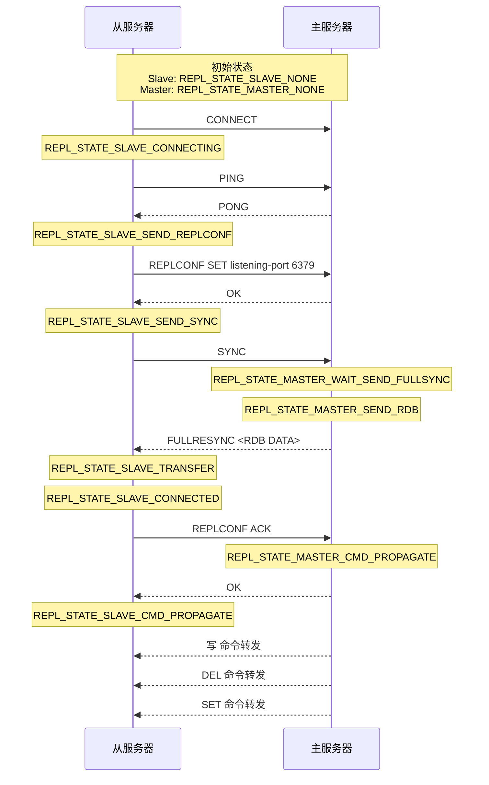

# redis基本

## 配置

### 安装配置 

默认7.0

```shell
sudo apt install redis-server
sudo service redis-server start

dong@Acer_S3_Dong:~$ sudo service redis-server
Usage: /etc/init.d/redis-server {start|stop|restart|force-reload|status
```

redis-cli

```shell
Info server #服务器版本

```

redis-server

```shell
redis-server --port 6379
redis-server --port 6380
```

### 事务

正常事务


事务中出错：（为字符串value自增）


有序集合

与普通集合set类似，但每个元素关联一个score，并根据分值自动排序。

```
ZADD fruit-price 10 banana 20 apple
ZSCORE fruit-price apple
ZRANK fruit-price apple
```


### 命名规范

Redis 的命名规范清晰简洁，通过前缀快速定位功能模块，以下是部分常用前缀对应的模块：

| **前缀**  | **模块** | **例子**                  |
| --------- | -------- | ------------------------- |
| z         | 有序集合 | zskiplist, zs        et   |
| s         | 字符串   | sds, sdshdr               |
| dict      | 哈希表   | dict, dictEntry           |
| list      | 链表     | list, listNode            |
| quicklist | 快速列表 | quicklist,  quicklistNode |
| db        | 数据库   | redisDb, dbAdd            |
| server    | 服务器   | serverCron,  serverLog    |
| anet      | 网络     | anetTcpConnect            |
| multi     | 事务     | multiState,  execCommand  |
| ae        | 事件循环 | aeMain,  aeAddFileEvent   |


## 字符串

redis字符串通过SDS对象表示，c字符串只只体现在字符串字面量。

两个应用场景。

1. 在redis数据库中，SDS对象用来保存字符串值。

比如，SET msg "helloworld" 在数据库创建一个键值对：

- 键是字符串对象，即SDS，SDS里面保存"msg"

- 值也是字符串对象，即SDS…

比如，RPUSH fruits "apple" "banana" "cherry" 向列表添加一些字符串。

- 键是字符串对象！ 内容是fruits
- 值是列表对象，每个元素是字符串对象

1. SDS用作缓冲区：比如AOF缓冲区，客户端状态的输入缓冲区。


### SDS

```c
struct sdshdr{
  int len;  
  int free;
  char buf[]; 
};
```

```c
// 从c字符串创建sds
sdshdr* sdsnew(const char* s);
// 创建一个空sds
sdshdr* sdsempty();
// 释放sds
void sdsfree(sdshdr* sds);
// sds长度
int sdslen(const sdshdr* sds);
// sds空闲长度
int sdsavail(const sdshdr* sds);
// 返回一个sds副本,,copy
sdshdr* sdsdump(const sdshdr* sds);
// 情况sds字符串内容
void sdsclear(sdshdr* sds);
// 将C字符串拼接到SDS末尾
void sdscat(sdshdr* dest, const char* s);
// 将sds字符串拼接到sds末尾
void sdscatsds(sdshdr* dest, sdshdr* src);
// 将C字符串覆盖写入SDS
void sdscpy(sdshdr* dest, const char* s);
// 用空字符将SDS扩展到指定长度
void sdsgrowzero(sdshdr* sds);
// 保留SDS区间内数据，不在区间内的数据会覆盖或者清除？
void sdsrange(sdshdr* sds, int start, int end);
// 从SDS移除出现再C字符串中的字符
void sdstrim(sdshdr* sds, const char* s);
// 比较两个sds字符串相同
void sdscmp(const sdshdr* sds1, const sdshdr* sds2);
```

### SDS与C字符串区别

**C字符串使用N+1长度字符数组表示长度N字符串，最后字节是'\0'。**

O(1)复杂度获取字符串长度

c字符串要想获取长度需要遍历字符串，O(N)。

redis字符串通过len属性直接获取。

至于，len属性的更新和设置是在调用SDS API时候自动完成。

比如，客户STRLEN 命令获取长度，为O(1)。

```shell
127.0.0.1:6379> STRLEN msg

(integer) 10
```


**杜绝缓冲区溢出**

因为C字符串不感知长度，例如strcat函数不安全，并不会检查源字符串，所以溢出。

而SDS字符串在修改时，会检查buf空间是否满足，如果不满足，自动扩展大小，再进行操作，不溢出。

比如，SDS中实现了sdscat。

 

**字符串修改频繁带来的内存重分配策略**

redis数据库会频繁修改数据修改字符串，不能够像C常规那样，每次修改都进行一次内存分配。

SDS通过free属性，实现空间预分配和惰性空间释放。

1. 空间预分配策略，用于字符串增长操作，操作之前，如果检查空间不够，则进行分配。

分配策略由下决定：

- 如果对SDS修改后，SDS的len值小于1MB，则分配len相同的free空间。比如，知道修改后len=13，那么free=13，buf=13+13+1
- 如果对SDS修改后，SDS的len值大于1MB，则分配1MB的free空间。比如，len=30MB，那么free=1MB，buf=30MB+1MB+1BYTE

1. 惰性空间（不）释放策略，用于字符串缩短操作，缩短SDS字符串时候，并不会直接回收一些字节，而是使用free属性记录下，以便将来使用。

比如，sdstrim(sds, "abc"）会从sds移除一些字符。

对于这些空间，也有API真正释放，而不会造成内存浪费。

 

**字节安全**

c字符串内部不能包含'\0'，否则会造成误读。c字符串通过'\0'判断字符串结束。

比如 redis'\0'cluster'\0'， redis通过len来判断字符串是否结束，不会造成歧义。

所以SDS的buf更多称为字节数组。

 

**兼容C字符串**

SDS可以兼容重用string.h一部分函数。

`strcmp(sds->buf, "hello world");`


## 链表

应用有：

- 当列表键值包含较多元素，或者元素都是较长字符串，redis就会使用链表作为列表键值的底层实现。
- 发布订阅、慢查询、监视器等用到了链表
- 服务器用链表保存多客户端信息，用链表构建客户端输出缓冲区等。


## 字典

字典应用：

- redis数据库底层就是字典实现的，比如增删改查。 SET msg     "hello"
- 当哈希键包含键值对较多，或者键值对元素中是较长字符串，字典作为哈希键底层实现

### 实现

redis字典通过哈希表实现，每个哈希表节点保存一个字典键值对。

分别介绍redis哈希表、哈希表节点、字典。

 

哈希表：

```c
typedef struct dictht {
  DictEntry** table; 
  unsigned long size; // table数组大小
  unsigned long sizemask; // 哈希表大小掩码，计算索引值，总是等于size-1
  unsigned long used; // 已用节点数
} DictHT;
 
```

哈希表节点：

每个哈希表节点保存一个键值对。

v属性表示的值可以是指针、u64、int64。

```c
typedef struct dictEntry {
  void* key;
  union {
    void* val;
    uint64_t u64;
    int64_t s64;
  }v;
  DictEntry *next;
} DictEntry;
```

字典：

```c
typedef struct dictType {
  unsigned int (*hashFunction)(const void* key);
  void* (*keyDup)(void* privdata, const void* key);
  void* (*valDup)(void* privdata, const void* obj);
  int (*keyCompare)(void* privdata, const void* key1, const void* key2);
  void (*keyDestructor)(void* privdata, void* key);
  void (*valDestructor)(void* privdata, void* val);
  
} DictType;
typedef struct dict {
  DictType* type;
  void* privdata;
 
  DictHT ht[2];
  int rehashidx; 
} Dict;
```

type和privdata属性是针对不同类型键值对，为创建多态字典创建

- type属性包含一簇函数指针， 操作键值对。 redis会为不同类型字典设置不同函数。
- privdata属性保存了需要传给那些多态函数的可选参数。

ht属性两个哈希表，一般只用ht[0]，另一个哈希表只在rehash时候使用。

rehashidx和ht[1]有关，记录了rehash目前进度，如果没有rehash，则为-1。


### 哈希算法

 当要添加一个键值对到字典，先根据键计算哈希值和索引值，在放到指定索引。

计算哈希值和索引值：

```c
hash = dict->type->hashFunction(key);
index = hash & dict->ht[x].sizemask;
 
redis字典作为数据库或者哈希键实现时候，使用Murmurhash2算法计算哈希值。
```

### 解决键冲突

dictEntry节点冲突时候，通过next解决，总是将新节点放在链表头部。

### rehash

随着操作进行，需要让哈希负载因子维持合理，即需要对哈希表进行扩缩，通过rehash重新散列完成。

步骤如下：

1. 为ht[1]内存分配，空间大小取决于当前entry数量ht[0].used：
   - 如果扩展，大小为 ≥      ht[0].used*2的 最小二次幂。比如used为4，则为8
   - 如果缩小， 大小为 ≥      ht[0].used的最小二次幂。比如used为4，则为4，不变
2. 将所有ht[0]上的entry重散列到ht[1]，即重新计算hash和索引，并放到ht[1]
3. 完成rehash后，释放ht[0]，将ht[1]设置为ht[0]，为ht[1]重新创建一个ht，为下一次rehash准备

 **哈希表扩展的触发**：

当任一条件被满足时，程序自动开始哈希表扩展：

- 服务器目前没有执行BGSAVE或者BGREWRITEAOF命令，且哈希表负载因子≥1
- 服务器正在执行BGSAVE或者BGREWRITEAOF命令，且负载因子≥5.

哈希负载因子 = ht[0].used / ht[0].size.

也就是说，负载因子维持合理即在不同命令下，要求不同。在BGSAVE或者BGREWRITEAOF命令时候，需要负载因子更大，即延迟禁止保护 哈希表的扩展。（比如100个used时候扩展，但现在500个used才能扩展）。这是因为，执行两个命令写RDB、AOF复制持久化文件时候，会fork子进程去做，会触发写时复制。比较写时复制时候进行扩展与否：

- 如果持久化时候进行扩展，主进程大量哈希表内存页修改，触发子进程复制原共享内存页，即为子进程创建大量内存，内存倍增！完成扩展后，子进程仍然面对的是原内存页，释放这些原内存页，子进程结束。父进程新哈希表。
- 如果持久化时候禁止扩展，共享内存页不变，子进程不创建新内存，子进程结束后。父进程在进行扩展等等。

 

**哈希表收缩触发**：

负载因子<0.5

 

**渐进式rehash**：

哈希表的扩缩不是一次性集中式完成的，而是分多次渐进式完成。如果有大量的rehash即计算、复制，导致服务器压力大。

渐进式通过dict.rehashidx记录，步骤如下：

1. Ht[1]分配内存，dict同时拥有两个哈希表，ht[0]作为旧哈希表不动，之后新数据插入
2. rehashidx设置为0，rehash工作开始
3. 在rehash期间，每次增删改查操作触发一个槽的rehash，这个槽索引为rehashidx，如果rehash完成，rehashidx+1。即从0-size，槽逐一rehash。
4. 最终，ht[0]成为空表，完成rehash，操作完成。

 

**渐进式rehash期间的哈希表正常操作：增删改查**

会在双表上进行，保持完整性。

插入：直接插入到ht[1]，ht[0]不进行插入操作。

删除：如果槽已经迁移，在ht[1]上删除操作。否则，ht[0]上操作。

查询：双表查询


## 跳跃表

定义：跳跃表是一个链表，每个节点包含不定数量的额外连接，节点第i个连接构成的单向链表跳过含有少于i个连接的节点。【算法：c语言实现第一部分-13.5】

跳跃表的每个节点维持多个其他节点指针，达到快速访问节点，平均O(logN)的查找。相较于链表，更能快速查找，这得益于一些额外的指针。在大部分情况下，跳跃表效率高于平衡树，很多情况，用跳跃表代替平衡树。


 应用：

- 当有序集元素较多，或者成员是较长字符串，redis就会用跳跃表作为有序集合键的底层实现。
- 集群节点中用作内部数据结构。

### 实现


## 对象

redis并没有通过那些数据结构直接实现键值对数据库，而是通过这些数据结构创建一个对象系统，有五种类型对象：字符串对象、列表对象、哈希对象、集合对象和有序集合对象。每种对象都用到之前至少一种数据结构。

好处：

- 不同场景下可以给对象设置不同类型实现。
- 执行命令前，可以安全判断类型

此外，redis对象实现引用计数的内存回收机制，如果程序不再使用某个对象，就会自动释放内存；此外这还能对象共享机制？使得在适当条件，多数据库共享同一个对象来节约内存？

redis对象带有访问时间记录信息，这可以计算数据库键的空转时间，


### 对象类型和编码

redis使用对象表示数据库的键、值，每次创建一个键值对，至少创建两个对象，键对象和值对象。

```c
typedef struct redisObject {
  unsigned type:4;    // 对象类型，例如字符串（REDIS_STRING）、列表（REDIS_LIST）
  unsigned encoding:4;  // 对象的编码方式，例如 RAW、INT 等
  unsigned lru:24;    // LRU 时间，用于记录对象的最近访问时间
  int refcount;      // 引用计数
  void* ptr;       // 指向对象具体数据的指针（底层数据结构）
} robj;
```

**type 类型**

```
共有五种对象类型。
数据库中键总是STRING对象，值可以是其中一类。所以，称“字符串键”指它的值是字符串对象，称“列表键”指它的值是列表对象。
enum robj_type{
  REDIS_STRING,
  REDIS_LIST, 
  REDIS_HASH, // 哈希
  REDIS_SET, // 集合
  REDIS_ZSET, // 有序集合
};
```

TYPE命令作用于键，返回值对象类型。


 

**encoding 和 ptr 底层实现**

encoding标识采用的数据结构，ptr指向具体数据。

```c
enum robj_encoding{
  REDIS_ENCODING_INT, // long类型整数
  REDIS_ENCODING_EMBSTR, // embstr编码的sds
  REDIS_ENCODING_RAW, // sds
  REDIS_ENCODING_HT, // 字典
  REDIS_ENCODING_LINKEDLIST, // 双端链表
  REDIS_ENCODING_ZIPLIST, // 压缩列表
  REDIS_ENCODING_INTSET, // 整数集合
  REDIS_ENCODING_SKIPLIST // 跳跃表和字典
};
通过OBJECT ENCODING查看对象编码：
```


这极大提高了redis灵活性，可以为不同场景设置不同编码即不同底层实现。

比如，列表元素较少时候，使用压缩列表实现，压缩列表更少内存，且内存连续，更容易载入；列表元素较多时候，通过双端链表实现。


### 字符串对象

**字符串对象encoding可以是：int、raw、embstr。**

1. int：如果对象保存的是整数值，且能用long表示，void* ptr视为long ptr


1. raw：如果对象保存的是字符串值，且长度大于32字节，void* ptr视为sds* ptr


1. embstr：如果对象保存的是字符串值，且长度≤32字节。void* ptr视为sds* ptr。 但与raw编码不同的是，embstr只会调用一次内存连续存储robj和sds。

   - 这使得释放只要一次，
   - 由于连续内存，更容易缓存读取。

   

   

   注意的是，对于浮点类型，也是作为字符串对象存储的，编码就是raw或者embstr

**字符串命令实现方法**

| **命令**    | **int****实现**                                          | **embstr****实现**                                           | **raw****实现**                                              |
| ----------- | -------------------------------------------------------- | ------------------------------------------------------------ | ------------------------------------------------------------ |
| SET         | int编码保存                                              | embstr保存                                                   | raw保存                                                      |
| GET         | 整数值转为字符串返回                                     | 直接返回                                                     | 直接返回                                                     |
| APPEND      | 对象转码为raw，再执行                                    | 对象转码为raw，再执行                                        | 调用sdscat函数追加                                           |
| INCRBYFLOAT | 将整数转为long double浮点，进行加法，保存为embstr或者raw | 将字符串转为long double浮点，进行加法，保存为embstr或者raw。 如果字符串不能转换，则返错 | 将字符串转为long double浮点，进行加法，保存为embstr或者raw。 如果字符串不能转换，则返错 |
| INCRBY      |                                                          |                                                              |                                                              |
| DECRBY      |                                                          |                                                              |                                                              |
| STRLEN      | 拷贝对象保存的整数值，转为字符串，返回长度               | 调用sdslen函数                                               | 调用sdslen函数                                               |
| SETRANGE    |                                                          |                                                              |                                                              |


### 列表对象


### 类型检查与命令多态

redis用于操作键的命令有两类：

1. 对任何类型键执行：DEL、EXPIRE、RENAME、TYPE、OBJECT
2. 对特定类型键执行：
   - 字符串键：SET、GET、APPEND、STRLEN
   - 哈希键：
   - 列表键：LLEN
   - 集合键
   - 有序集合键

因此，对于特定类型键命令，需要进行类型检查，如果不匹配，返回类型错误。


### 内存回收

 

通过robj.refcount引用计数自动回收。

refcount计数规则：

- 创建对象。值为1
- 需要对象时候，++。 比如添加到列表
- 不再被，值--。 比如从列表删除
- 计数值为0，回收。

涉及api：

| incrRefCount  | ++                                          |
| ------------- | ------------------------------------------- |
| decrRefCount  | --， 为0时候释放                            |
| resetRefCount | 置0，但不释放，在需要重新涉及计数时候使用。 |

### 对象共享

场景：键A和键B都创建保存了整数100的字符串键。

两种方法：1. 创建两个对象，两片内存。 2. 两个键指向同一个内存对象。

显然第二种更好，需要做的只是让值指向同一对象，对象引用计数+1.

因此，redis初始化会创建10000个字符串对象， 服务器最初共享对象。

可以通过OBJECT REFCOUNT查看。


2147483647（2^31 - 1）。

Redis 会对一些常见的小整数（例如 0、1、2、...、10000）创建共享对象。这些共享对象会在 Redis 启动时初始化，并在整个运行过程中被重用。为了避免共享对象被错误地释放，Redis 将这些对象的引用计数设置为一个很大的值（2147483647），表示它们永远不会被释放。

判断共享，需要验证类型、保存值等，为了复杂度，redis指对包含整数值的字符串对象进行了共享


### 对象空转

Robj.lru属性记录最后一次访问时间。

1. OBJECT IDLETIME命令计算空转时间


2. lru算法回收内存，如果排在maxmemory和lru算法，超过最大上限内存时候，空转时间较长的键优先释放，回收内存。


# 复制

开启两个服务器，下面命令表示，当前访问服务器成为6740的从

`SLAVEOF 127.0.0.1 6740`



命令传播阶段：每秒发送REPLCONF ACK进行**心跳检测**。

> 最后一次交互时间 距今 已经超时。 发送这个就是保证一直有交互

从第一次connect开始时候， 就需要定时进行心跳检测，检测失败就会重试 重新进入复制流程。


## sentinel

启动

1. sentinel.conf读取，  与监控主建立联系
2. 发送`INFO`命令。 响应内容

```
run_id:aaaaaaa
role:master #服务器角色
slave0:ip=127.0.0.1,port=11,state=online
```

3. 处理`INFO`响应，更新instances


# 事件循环

aeFileEvent和connectionType:

- 前者直接面对fd，较简。  后者抽象度高，上升到conection.


redis服务器是事件驱动程序，需要处理两类事件：

- 文件事件：redis服务器与客户端或者其他服务器进行连接，文件事件是对套接字操作的抽象。通信会产生很多套接字文件事件，服务器监听处理这些来完成网络通信。
- 时间事件：定时操作。

 ```c
// 事件循环

typedef struct aeEventLoop {

  int maxfd; // 目前最大注册fd

  int maxsize;  // 支持的最大fd-1。即events数组大小。

  aeFileEvent* events;  // 已注册事件数组。events[0]对应fd为0.

  aeFileEvent* fireEvents;  // 触发的事件队列。

  aeApiState* apiState;  // IO多路复用状态

  int stop;  // 事件循环停止标志

} aeEventLoop;
 ```


 

注册和触发事件：

- 为fd注册事件读/写，events[fd].mask包含     AE_READABLE/AE_WRITABLE, 并且对于fileproc指向回调
- IO复用等待返回填充到fireevtns，如果fd读/写事件触发，fireevents就会有一个{fd,     AE_READABLE/AE_WRITABLE}
- 注册事件是静态的，存储所有注册事件
- 触发事件队列是动态，存储当前已触发事件，

## 文件事件


基于Reactor模式开发了自己的网络事件处理器：file event handler.

- 多路复用，监听多套接字，根据套接字执行任务关联不同事件处理器。
- IO复用ready后，通过关联的处理器进行执行。


事件循环：IO多路复用会把ready的套接字放到队列，逐一送到分派处理，只有处理完成后，才会继续从队列取出处理。

 

### IO多路复用机制

整体分为三阶段：

1. 事件注册：将描述符或者事件注册到事件循环。
2. 事件等待：使用select、epoll等待事件触发。
3. 事件处理：触发事件后，调用注册的回调器处理。

 

```
// 事件循环
typedef struct aeEventLoop {
  int maxfd; // 目前最大注册fd
  int maxsize;  // 支持的最大fd。即events数组大小。
  aeFileEvent* events;  // 已注册事件数组。events[0]对应fd为0.
  aeFileEvent* fireEvents;  // 触发的事件队列。
} aeEventLoop;
 
// 注册事件
typedef struct aeFileEvent {
  int type;  // AE_READABLE，AE_WRITABLE
  aeFileProc* rfileProc;  // 事件读处理程序
  aeFileProc* wfileProc; // 事件写处理程序
  void* procArg; // 事件处理程序参数
} aeFileEvent;
// 触发事件
typedef struct aeFireEvent {
  int fd;
  int type;  // 标记events[fd]触发上触发的事件类型。
} aeFireEvent;
```

## 时间事件：

- 定时：
- 周期

```c
typedef struct aeTimeEvent {

  long long id;  // 时间事件id

  long when; // 毫秒时间戳

  aeTimeProc* timeProc;  // 时间事件处理函数

  void* procArg; // 时间事件处理函数参数

  struct aeTimeEvent* next;  // 下一个时间事件

} aeTimeEvent;
```

id从小到大递增，新事件ID＞旧事件ID


定时心跳、info事件 穿插在正常的其他都事件流中， 需要很明确的将其分开。

 

## RESP协议

| **数据类型**         | **前缀** | **示例**                         |
| -------------------- | -------- | -------------------------------- |
| 简单字符串           | `+`      | `+OK                             |
| 错误信息             | `-`      | -ERR unknown  command            |
| 整数                 | :        | :100                             |
| 批量字符串           | $        | $5\r\nhello\r\n                  |
| 多条批量字符串（数组 | *        | *2\r\n$3\r\nfoo\r\n$3\r\nbar\r\n |

RESP 设计简单高效，便于解析，同时支持二进制安全的数据传输。

【问题】

1. 为什么RESP没有全局起止符号？这在RESP+RDB这样的内容下还要解析，而非直接获取。

优点：如果是这样，RESP格式内容边界很清晰。能够完整获取一个RESP内容。

```
<START>+OK\r\n<END>
<START>*3\r\n$3\r\nSET\r\n$3\r\nkey\r\n$5\r\nvalue\r\n<END>
<START>+FULLRESYNC repl-id offset\r\n$1024\r\n<RDB data><END>
```

缺点：

- 冗余开销：每个消息多12个字节，对于高频SET GET 命令性能影响。
- 不符合TCP流式传输：需要等待完整一个RESP消息传来。

`{ping}` -> `*1\r\n$4\r\nping\r\n`

```c

```


## 服务器

多类型监听是什么，为什么？一种类型需要多端口监听吗？

1. TCP 6379; TLS 6380; Unix socket `/tmp/redis.sock`
2. 同一类型如tcp通过多路复用即可搞定大并发，所以不需要。


 ## 套接字

`EAGAIN` 描述符是非阻塞模式，当前操作请等候。 表示 写缓冲满或读缓冲空

`EINTR` 阻塞操作被信号打断。

# 数据库

##  服务器的数据库

```c
struct redisServer {
 
  int dbnum;
  redisDb *db;
};
```

每个redisDb代表一个数据库，dbnum表示服务器数据库个数。默认会创建16个，由database配置选项决定。

数据库键值对都是robj对象，

## 数据库切换


每个redis客户端都有一个目标数据库，可以通过SELECT选择，默认是db[0]数据库。

SELECT 2 即选择db[2]数据库

客户端状态redisClient种db属性记录目标数据库。但是从命令方面，客户端不知道自己正在使用哪个数据库。


## 键空间

redis是一个键值对数据库服务器，每个数据库由redisDb表示。

```c
typedef struct redisDb {
  dict *dict; // 键空间：保存所有键值对
} redisDb;
```

dict属性持有所有键值对，称为键空间。键即是字符串对象，值即是redis对象。
针对数据库增删改查操作，即是对字典dict的操作。

```shell
SET date "2023-01-10"
DEL date
```

还有一些是针对键空间操作，比如FLUSHDB会删除所有键值对，RANDOMKEY随机返回键值。
DBSIZE返回键值对数量，EXISTS,RENAME,KEYS等。

### 读写键空间时的维护操作

使用命令进行读写时候，还有一些额外维护操作：

- 读取键时候（读写都要读取键），会根据键是否存在更新INFO stats命令的keyspace_hits     和 keyspace_misses指标，这两个表示是否命中，即键是否在服务器。
- 读取键后，会更新键的LRU
- 读取键发现键过期们就会删除键，在执行。
- 如果客户端使用WATCH命令监视这个键，服务器修改键之后会将其标记为dirty，让事务程序注意。
- 服务器每次修改一个键，脏键计数器都会+1，之后会触发持久化或复制。
- 如果开启了数据库通知功能，键修改后，还当按配置发送通知。

### 键生存/过期

 通过EXPIRE或者PEXPIRE（毫秒级）命令，客户端指定键的生存时间TTL，经过指定时间，服务器自动删除剩余时间为0的键。


类似，EXPIREAT或者PEXPIREAT表示在某个UNIX时间戳过期。

TTL命令和PTTL命令则返回键的剩余时间

### 设置过期时间的实现

都可以转化为PEXPIREAT执行。

 ### 数据库保存键过期时间


```c
typedef struct redisDb {
// …
  dict* expires; // 过期字典：保存所有键的过期时间。
} redisDb;
```

过期字典的键是一个指针，指向键空间的某个键。

过期字典的值是一个long long的整数，保存对应的过期时间——毫秒级的unix时间戳。

 

### 移除过期时间

PERSIST命令移除键的过期时间。会从过期字典移除。


### 过期键的判定

通过TTL和PTTL返回


### 删除策略

删除策略，已知一个键过期，如何删除？

- 定时删除：对键设置过期时间同时，创建定时器，定时器到了立即执行。
- 惰性删除：每次从键空间读键时候，过期则删除。
- 定期删除：每隔一段时间，数据库检查，删除过期键。

 

**定时删除**

优点：定时删除能及时释放内存。

缺点：

1.  如果过期键比较多，同一时间会删除大量键，占用大量CPU时间。
2.  redis创建定时器需要时间时间，时间事件实现方式是无序链表，复杂度0(N)，大量事件事件不能高效处理

事实上，如果有大量命令请求需要处理，又不缺少内存，不应该此时去处理过期键，而是优先命令请求。

综述：所以并不现实。

 

**惰性删除**

优点：对CPU友好，只在非做不可情况下去做，且可以直接删除当前处理键。

缺点：无用的垃圾数据会占用大量内存。

比如，记录一些log，记录后很少访问，内存大大浪费。

 

**定期删除**

定期删除策略为折中，但难度在于设置删除频率。

 

## RDB持久化

### RDB 格式

在 Redis RDB 文件中，文件标记（magic values）用于区分数据结构、类型和边界，确保存储和解析一致。选择合适的值通常遵循以下原则：

1. **唯一性**：确保标记值不会与正常数据冲突。（普通数据不会用到的字节）
2. **可扩展性**：预留空间，避免未来变更影响格式
3. **易解析**：选择固定字节长度，避免不必要的位运算

**总结**

| **标记**     | **作用**     | **典型取值**     |
| ------------ | ------------ | ---------------- |
| 文件头       | 版本识别     | REDIS0009        |
| EOF          | 结束标记     | 0xFF             |
| DB Selector  | 选择数据库   | 0xFE + dbid      |
| Type         | 数据类型     | 0x00 ~ 0x05      |
| Encoding     | 存储方式     | 0x00 ~ 0x03      |
| 可变长度编码 | 存储数据长度 | 0x00 ~ 0x80      |
| 特殊整数     | INT8/16/32   | 0xFC, 0xFD, 0xFE |
| 辅助信息     | 额外字段     | 0xFA             |

这些值是 Redis 选择的标准，它们能确保 RDB **高效、可扩展、易解析**。🚀

### Redis BGSAVE

Redis 在 BGSAVE 过程中，使用 Linux 信号（signal）机制 来管理主进程和子进程的通信，确保 BGSAVE 进程状态能够被正确追踪。

 

1. signal 机制在 Redis BGSAVE 的作用

Redis 采用 SIGCHLD 信号 监测 BGSAVE 进程的退出：

- 子进程 exit(0)（成功）或 exit(1)（失败）后，Linux 自动向父进程发送 SIGCHLD 信号。
- 父进程通过 SIGCHLD 处理函数     sigChildHandler() 识别 BGSAVE 的结果： 
  - 成功：更新 server.lastsave（最后成功 BGSAVE 的时间）。
  - 失败：清理 server.rdb_child_pid，避免误判进程状态。

 

2. BGSAVE 触发流程

3. Redis 主进程 调用 fork() 创建 BGSAVE 子进程：
   - 子进程      执行 rdbSave() 写入 RDB 文件。
   - 父进程      继续接收客户端请求，等待 SIGCHLD。
4. 子进程执行 rdbSave() 完成后，调用 exit(0) 退出：
   - 操作系统自动向父进程发送 SIGCHLD 信号。
5. Redis     主进程收到 SIGCHLD 信号，进入     sigChildHandler()：
   - waitpid() 处理子进程状态。
   - server.lastsave =      server.unixtime; 更新 BGSAVE 完成时间。
   - server.rdb_child_pid = -1; 清空 BGSAVE 进程 ID。

 

3. 代码实现

(1) fork() 创建 BGSAVE 进程

在 rdbSaveBackground()：

```c
if ((childpid = fork()) == 0) {
   /* 这是子进程，执行 rdbSave() */
   if (rdbSave(server.rdb_filename) == C_OK) {
     exit(0); // 成功，返回 0
   } else {
     exit(1); // 失败，返回 1
   }
 }
```


✅ 子进程成功执行 rdbSave() 后，调用 exit(0) 退出。

 

(2) SIGCHLD 处理

Redis 在 setupSignalHandlers() 里注册 SIGCHLD 处理函数：

signal(SIGCHLD, sigChildHandler);

SIGCHLD 触发时，调用 sigChildHandler()：

```c
void sigChildHandler(int sig) {
   pid_t pid;
   int stat;
   
   // 处理多个可能结束的子进程
   while ((pid = waitpid(-1, &stat, WNOHANG)) > 0) {
     if (pid == server.rdb_child_pid) {
       // 子进程退出时，检查状态
       if (WIFEXITED(stat) && WEXITSTATUS(stat) == 0) {
         server.lastsave = server.unixtime; // 记录成功时间
       }
       server.rdb_child_pid = -1; // 清空 RDB 进程 ID
     }
   }
 }
```


✅ waitpid(-1, &stat, WNOHANG) 作用：

- -1：等待任何子进程。
- WNOHANG：如果没有子进程退出，不阻塞进程。

 

4. 总结

| 事件              | 触发者 | 作用                               |
| ----------------- | ------ | ---------------------------------- |
| fork()            | 父进程 | 创建 BGSAVE 子进程                 |
| rdbSave()         | 子进程 | 执行 RDB 持久化                    |
| exit(0)           | 子进程 | BGSAVE  完成，自动发送 SIGCHLD     |
| sigChildHandler() | 父进程 | 处理 SIGCHLD，更新 server.lastsave |

✅ SIGCHLD 机制 让 Redis 父进程可以正确追踪 BGSAVE 的状态，而无需主动查询子进程。

 

 
