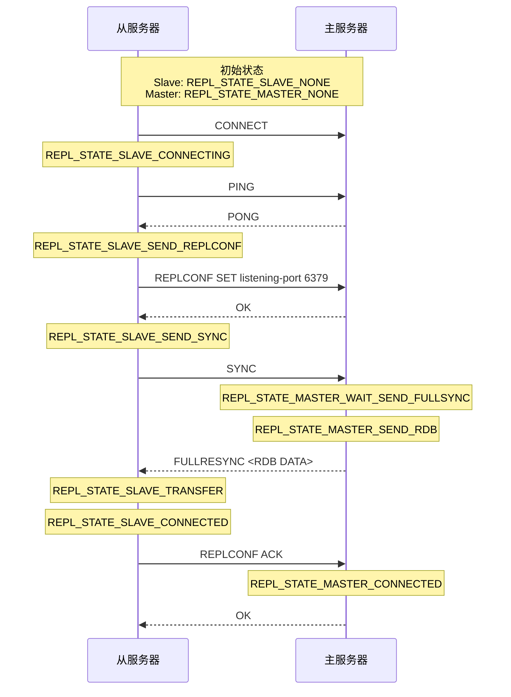

## 复制

开启两个服务器，下面命令表示，当前访问服务器成为6740的从

`SLAVEOF 127.0.0.1 6740`




注意

- 变为从之后，不接受客户端请求，所以原来客户端中断连接

## 心跳检测

每秒向主发送REPLCONF ACK <>


## sentinel

启动

1. sentinel.conf读取，  与监控主建立联系
2. 发送`INFO`命令。 响应内容

```
run_id:aaaaaaa
role:master #服务器角色
slave0:ip=127.0.0.1,port=11,state=online
```

